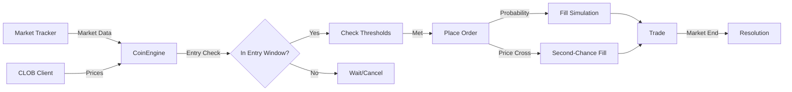

# Polymarket Strategy Tester v2.1 - Architecture

## Overview

The Polymarket Strategy Tester is a paper trading bot that monitors Polymarket 15-minute crypto markets and simulates trading strategies to evaluate their performance without risking real capital.

## Code Structure

```
src/
├── config.py          # Configuration management, thresholds, entry window timing
├── models.py          # Data models: Order, Trade, Metrics, VariantMetrics
├── market_tracker.py  # Polymarket API integration, market discovery
├── strategy_engine.py # Core trading logic, strategy variants, order management
└── clob_client.py     # CLOB API client for price fetching

web/
├── api.py             # FastAPI backend with REST and WebSocket endpoints
└── static/
    ├── index.html     # Main dashboard with aggregate metrics, coin cards
    ├── btc.html       # Bitcoin coin-specific dashboard
    ├── eth.html       # Ethereum coin-specific dashboard
    ├── sol.html       # Solana coin-specific dashboard
    ├── xrp.html       # XRP coin-specific dashboard
    └── style.css      # Shared styles
```

## Key Components

### 1. Strategy Engine (`src/strategy_engine.py`)

The core trading logic is organized into two classes:

- **CoinEngine**: Manages trading for a single coin (BTC/ETH/SOL/XRP)
  - Runs an async loop checking entry conditions every 2 seconds
  - Supports multiple strategy variants (undervalued_49, undervalued_48, etc.)
  - Handles order placement, fill simulation, and trade resolution
  - Tracks per-variant metrics independently

- **StrategyEngine**: Orchestrates all CoinEngine instances
  - Provides aggregate metrics across all coins
  - Manages global start/stop operations

### 2. Strategy Variants

v2.1 introduces multiple undervalued thresholds running simultaneously:

| Variant | Threshold | Description |
|---------|-----------|-------------|
| `undervalued_49` | ≤$0.49 | Most aggressive |
| `undervalued_48` | ≤$0.48 | Default threshold |
| `undervalued_47` | ≤$0.47 | Moderate |
| `undervalued_46` | ≤$0.46 | Most conservative |
| `momentum` | ≥$0.52 | Follow smart money |

Each variant tracks independent statistics (trades, wins, P&L, ROI).

### 3. Entry Window Logic

Orders are only placed when the market countdown is within the entry window:

```
Entry Window: 20:30 → 15:30 (countdown in mm:ss)
              1230s → 930s  (in seconds)
```

- Orders placed only when `930 ≤ countdown ≤ 1230`
- Unfilled orders are cancelled when countdown reaches 930

### 4. Market Tracker (`src/market_tracker.py`)

Discovers and monitors Polymarket markets using the Gamma API:
- Dynamically generates market slugs based on current time
- Supports 15-minute market rotation
- Fetches market resolution outcomes

## Data Flow



## UI Updates & WebSocket

### Real-time Updates

The frontend connects via WebSocket to receive updates every 2 seconds:

- **Global WebSocket** (`/ws`): Aggregate metrics, prices for all coins, last 20 trades
- **Coin WebSocket** (`/ws/{coin}`): Coin-specific orders, trades, metrics, variant metrics

### Show More Persistence

The "Show More" bug was fixed by:
1. Storing expansion state (`showAllOrders`, `showAllTrades`) outside the update cycle
2. Skipping table updates when expanded (only updating info text)
3. Re-fetching all data via API when total count changes
